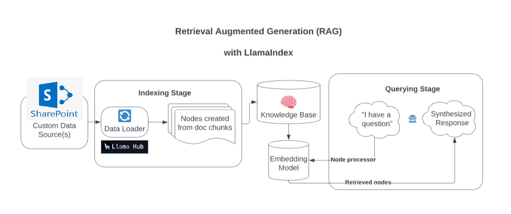

# Builded end-to-end chatbot with SharePoint (Custom data) sources, powered by LlamaIndex & OpenAI API

## Setup and Installation

1. Clone the repository
2. Install dependencies: `pip install -r requirements.txt`
3. Set up environment variables for SharePoint and OpenAI API credentials. For more details on sharepoint setup please refer (https://llamahub.ai/l/readers/llama-index-readers-microsoft-sharepoint?from=)
4. Run the application: `streamlit run streamlit_app.py`

## Usage

1. Launch the Streamlit app
2. Enter your query in the chat interface
3. Receive AI-generated responses based on the SharePoint knowledge base

## Development Process

1. **SharePoint Integration**: Implemented a custom connector to fetch and update data from SharePoint lists and document libraries.
2. **Data Indexing**: Utilized LlamaIndex to create an efficient search index of the SharePoint data.
3. **OpenAI Integration**: Integrated OpenAI's API to generate contextually relevant responses.
4. **Streamlit UI Development**: Designed and implemented an intuitive user interface using Streamlit.
5. **Testing and Optimization**: Conducted thorough testing and performance optimization to ensure smooth user experience.

## Future Enhancements

- Implement user authentication
- Add support for multiple SharePoint sites
- Implement a feedback mechanism for continuous improvement
- Implement multi-model

## Contributing

Contributions, issues, and feature requests are welcome. Feel free to check [issues page](https://github.com/sharad28/Chatbot_streamlit_llamaindex/issues) if you want to contribute.

## License

[MIT](https://choosealicense.com/licenses/mit/)

## Contact

Sarad Mishra - [saradmishra28@gmail.com]

LinkedIn Link: [https://www.linkedin.com/in/sharad-mishra-1568b566/](https://www.linkedin.com/in/sharad-mishra-1568b566/)

reference : 
1. (https://blog.streamlit.io/build-a-chatbot-with-custom-data-sources-powered-by-llamaindex/)
